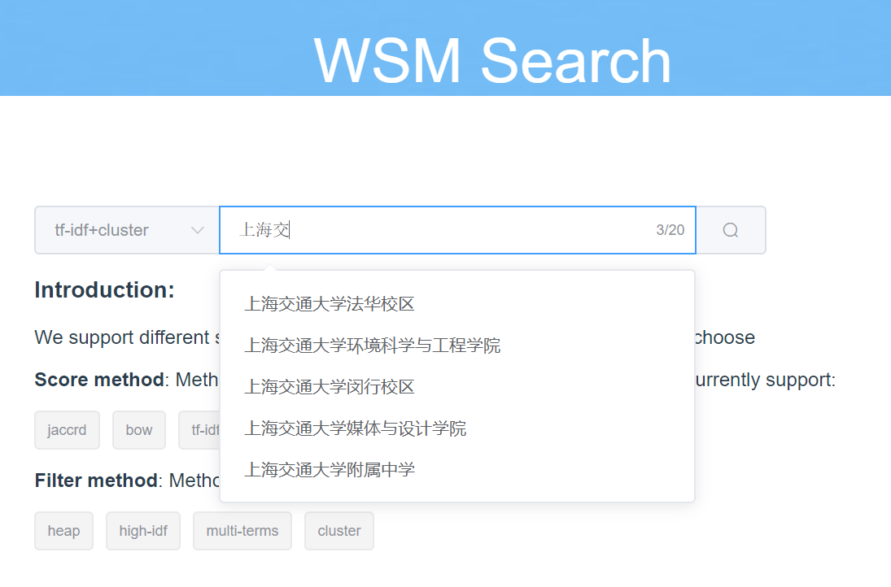

# wikipedia-search-engine

## Prerequisites

1. jieba
2. flask
3. wikipedia-zh dump dataset

## Quick Install

**install wikisearch**
```bash
# Enter a virtual environment (anaconda/virtualenv)
git clone https://github.com/QimingZheng/wikipedia-search-engine
git submodule update --init --recursive
python setup.py install # install wikisearch
```

**download wikipedia dump data and parse into jsons**
```bash
bash download.sh
```


**Test**
```bash
cd testings/
python test_indexer.py
python test_searcher.py
python test_query.py
```

**run web**

See [Front-End Doc](./doc/frontend_setup.md)

!

!

## Prebuilt Index, Meta and Query Trie for Full-Dataset (Jbox Links)

1. [Doc-Vector-Index](https://jbox.sjtu.edu.cn/l/z5idA4)
2. [Inverted-Index](https://jbox.sjtu.edu.cn/l/3Jv9iT)
3. [Meta Data](https://jbox.sjtu.edu.cn/l/snpjmn)
4. [Query Suggestion Trie](https://jbox.sjtu.edu.cn/l/I51LRJ)

## TODOs

* [ ] refactoring this project (cleaner code)
* [ ] add docs
* [ ] more parallel support
* [ ] more unittests

## Reference

[Introduction to Information Retrieval](https://nlp.stanford.edu/IR-book/)
